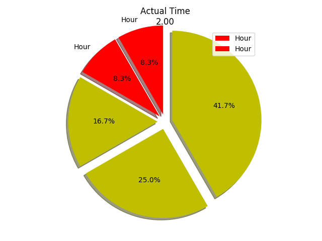

# Fibonacci Clock:
## What is Fibonacci Clock ?
Fibonacci Clock is built with the help of first 5 numbers of fibonacci sequence (except '0') i.e. 1, 1, 2, 3, 5. With the help of these five numbers we can represent any time within a day. As we have used fibonacci sequence to represent the time that's why it's called Fibonacci Clock.

## How it works ?
The screen of the clock is made up of five squares whose side lengths match the first five Fibonacci numbers: 1, 1, 2, 3 and 5. The hours are displayed using red and the minutes using green. When a square is used to display both the hours and minutes it turns blue. White squares are ignored. To tell time on the Fibonacci clock you need to do some math. To read the hour, simply add up the corresponding values of the red and blue squares. To read the minutes, do the same with the green and blue squares. The minutes are displayed in 5 minute increments (0 to 12) so you have to multiply your result by 5 to get the actual number.

## Some trivial cases:
Often, there are multiple ways to display a single time. To add to the challenge, the combinations are picked randomly from all the different ways a number can be displayed. There are, for example, 16 different ways to display 6:30 and you never know which one the clock will use!

## Some overview of Fibonacci Clock:

